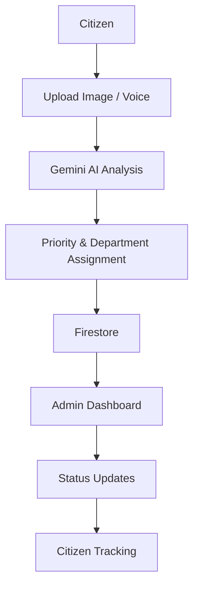

# Community Hero

AI-powered multilingual civic issue reporting platform built for Google Solution Challenge.


## Overview

Community Hero addresses a common civic gap: residents often report issues through fragmented channels, but they rarely receive transparent follow-up. This project provides a modern, multilingual experience for citizens to submit civic issues with images or voice notes, receive AI-assisted analysis, and track their reports through a live workflow.

The platform is designed to strengthen transparency between citizens and local authorities by combining Firebase-backed data storage, Gemini-based AI assistance, multilingual interaction, and interactive maps.

## Features

| Feature | Status |
| --- | --- |
| AI-assisted report analysis | ✓ |
| Image and video analysis with Gemini | ✓ |
| Speech-to-text reporting | ✓ |
| Text-to-speech for report details | ✓ |
| Multilingual interface and translation | ✓ |
| Firebase Authentication | ✓ |
| Firestore-based report and profile storage | ✓ |
| Live report tracking | ✓ |
| Interactive OpenStreetMap experience | ✓ |
| Dashboard for citizens | ✓ |
| Admin panel for report oversight | ✓ |
| Responsive UI | ✓ |

## Workflow



## Tech Stack

| Area | Technologies |
| --- | --- |
| Frontend | Next.js 16, React 19, TypeScript |
| Styling | Tailwind CSS, shadcn/ui, Radix UI |
| Backend | Next.js App Router API routes |
| Database | Firebase Firestore |
| Authentication | Firebase Authentication |
| AI | Gemini via @google/genai |
| Maps | OpenStreetMap, Leaflet, react-leaflet |
| UI Motion | Framer Motion |
| Internationalization | i18next, react-i18next |
| Deployment | Production-ready Next.js build for cloud deployment |

## Google Technologies Used

Community Hero uses the following Google technologies directly in the current implementation:

- Gemini API for image and video analysis, AI-generated summaries, priority scoring, department recommendations, and translation.
- Firebase Authentication for secure sign-in and user sessions.
- Cloud Firestore for storing reports, user profiles, and report status history.
- Google AI Studio concepts are reflected through the Gemini integration used by the application.

## Project Structure

```text
src/
  ai/
    agents/
    gemini/
  app/
    api/ai/analyze/
    api/ai/translate/
    admin/
    dashboard/
    map/
    report/
    reports/
    contact/
    privacy/
    terms/
  components/
  features/
    admin/
    analytics/
    auth/
    dashboard/
    landing/
    location/
    map/
    profile/
    report/
    tracking/
    gamification/
  firebase/
  i18n/
```

## Installation

```bash
git clone https://github.com/Shrestha-Swami/community-hero.git
cd community-hero
npm install
npm run dev
```

The app will be available at http://localhost:3000.

## Environment Variables

Create a local environment file with the variables below before running the app.

### Required

```env
NEXT_PUBLIC_FIREBASE_API_KEY=
NEXT_PUBLIC_FIREBASE_AUTH_DOMAIN=
NEXT_PUBLIC_FIREBASE_PROJECT_ID=
NEXT_PUBLIC_FIREBASE_STORAGE_BUCKET=
NEXT_PUBLIC_FIREBASE_MESSAGING_SENDER_ID=
NEXT_PUBLIC_FIREBASE_APP_ID=
GOOGLE_API_KEY=
```

### Optional

```env
NEXT_PUBLIC_FIREBASE_MEASUREMENT_ID=
GEMINI_MODEL=gemini-2.5-flash
```

## AI Workflow

The AI workflow in the current repository is implemented as follows:

- Image upload: citizens can attach an image or video during report submission.
- Gemini vision analysis: the uploaded media is sent to the analysis API, which returns category, severity, confidence, priority score, department, and summary.
- Priority prediction: the AI response includes a priority score used in the interface and admin views.
- Department recommendation: the analysis returns a recommended department for routing.
- Summary generation: the platform stores and displays an AI-generated summary for each report.
- Translation: the app includes a dedicated translation route for multilingual content support.

## Localization

Community Hero currently supports the following languages in the interface:

- English
- Hindi
- Gujarati
- Marathi
- Bengali
- Tamil
- Telugu
- Kannada

The UI is powered by i18next and react-i18next, with dynamic translation support for report summaries and interface content. Voice accessibility is also included through browser-based speech recognition and speech synthesis.

## Screenshots

Screenshots can be added here once the project is deployed or captured locally.

- Hero section
- Report page
- Live map
- Dashboard
- Admin panel
- Tracking view
- Authentication flow

## Performance

The current implementation emphasizes a polished user experience through:

- Responsive design for desktop and mobile screens
- Next.js App Router structure
- Dynamic loading for the interactive map component
- Framer Motion animations and polished transitions
- Accessibility-friendly form controls and labels

## Deployment

Community Hero is built as a standard Next.js application and is suitable for deployment on Google Cloud.

Recommended production flow:

```bash
npm run build
```

Deploy the built application with the required environment variables configured in your cloud environment.

## Future Scope

Potential next steps include:

- Government ERP integration
- Push notifications
- Advanced analytics and reporting dashboards

## Author

Name: Shrestha Swami

Role: B.Tech CSE (Data Science), SKIT Jaipur

GitHub: https://github.com/Shrestha-Swami/community-hero

LinkedIn: https://www.linkedin.com/in/shrestha-swami/

Email: shresthaswami25@gmail.com

## Acknowledgements

- Google Solution Challenge
- Firebase
- Google AI Studio / Gemini
- Next.js
- OpenStreetMap
- Leaflet

## License

No license file is currently present in this repository, so the project does not declare a license yet.
